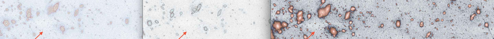

# Exposing-the-Unseen-Layers-of-the-Cosmos

## Anomaly-1: 

This quadrant of the image reveals a distinct triangular shape, standing out as white or blank against the densely packed background of celestial objects (galaxies and stars). It is more clearly defined in the deconstructed layers.

The triangle spans half of the image vertically, tapering from a wider top to a sharper bottom, forming an inverted isosceles triangle. This empty space likely represents either:

- A data dropout or gap in the astronomical imaging process.
- A masked or occluded sensor area in the telescope.

--------------

## Anomaly-2: 

The arrows highlight a faint line situated above and to the left of a bright, saturated central object—most likely a galaxy. This line is visible across all three versions of the image, though with differing degrees of clarity. It extends across stars and galaxies, indicating that it is likely not of astrophysical origin. 

-------------

Note, the blue arrow marks a distinct bend or kink in the otherwise straight path of the line.

--------------

## Anomaly-3: 

The object indicated by the arrow is more than a simple dot or empty region — it’s a textured, swirling structure, most clearly visible and analyzable in the right panel. Its intricate form..., and further processing power is needed to extract more detailed...

--------------
_Image Original Source: https://esawebb.org/images/potm2504a/_

--------------

